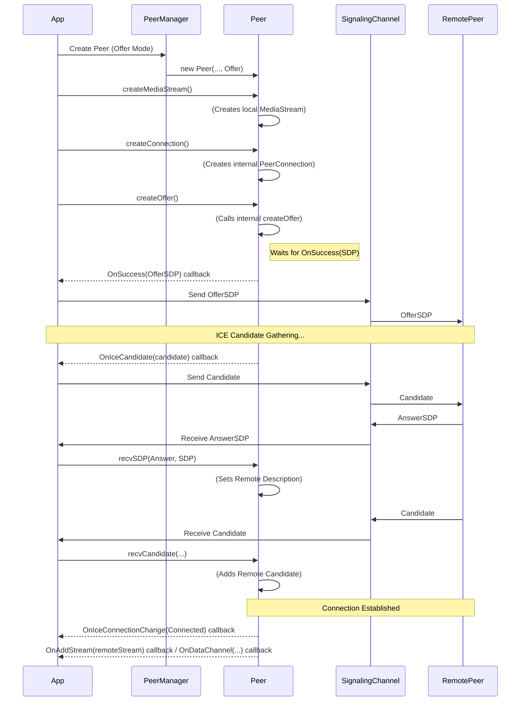

# WebRTC 模块 (`src/webrtc`)

## 概览

`webrtc` 模块封装了 Google 的 WebRTC 原生库 (`libjingle`)，提供了在 LibSourcey 框架内创建和管理点对点 (P2P) 音视频和数据连接的能力。

## 关键组件与概念

*   **头文件位置:** `src/webrtc/include/scy/webrtc/`
*   **依赖:** `scy/base`, `scy/net`, `scy/av` (可能用于媒体捕获/处理), `Google WebRTC (libjingle)`

*   **核心抽象:**
    *   **`Peer` (`peer.h`):** WebRTC 连接的核心封装类。
        *   继承自 `webrtc::PeerConnectionObserver` 和 `webrtc::CreateSessionDescriptionObserver`，用于处理来自底层 WebRTC 库的回调。
        *   封装了 `webrtc::PeerConnectionInterface`。
        *   管理连接生命周期 (`createConnection`, `closeConnection`)。
        *   处理信令交换：创建 Offer (`createOffer`)，接收 SDP (`recvSDP`)，接收 ICE Candidate (`recvCandidate`)。
        *   处理 WebRTC 事件回调 (如 `OnIceCandidate`, `OnAddStream`, `OnDataChannel`, `OnIceConnectionChange`)。
        *   需要 `PeerManager` 和 `PeerFactoryContext` 进行管理和创建。
    *   **`PeerManager` (`peermanager.h`):** (推测) 用于管理多个 `Peer` 实例的生命周期和查找。
    *   **`PeerFactoryContext` (`peerfactorycontext.h`):** (推测) 提供创建 `PeerConnectionFactory` 所需的共享资源 (如线程、网络管理器、Socket 工厂)。

*   **媒体集成:**
    *   **`createMediaStream()` (in `Peer`):** 创建本地 `webrtc::MediaStreamInterface`。
    *   **(推测) 与 `av` 模块集成:**
        *   `YuvVideoCapturer`, `VideoPacketSource`: 可能将 `av` 模块的视频采集适配到 WebRTC。
        *   `AudioPacketModule`, `FakeAudioDeviceModule`: 可能处理音频的采集和播放，与 WebRTC 的音频设备管理 (ADM) 对接。
        *   `MultiplexMediaCapturer`: 可能结合音视频采集提供给 `Peer`。
    *   `StreamRecorder`, `RecordingPeer`: 可能提供了录制 WebRTC 流的功能。

*   **信令:**
    *   模块本身不包含完整的信令服务器实现。
    *   `Peer` 类提供了处理 SDP (`recvSDP`) 和 ICE Candidate (`recvCandidate`) 的接口，以及生成 Offer (`createOffer`) 和 Candidate (`OnIceCandidate` 回调) 的能力。
    *   开发者需要将这些信令消息通过外部机制 (如 WebSocket、HTTP 或 `symple` 模块) 在对等端之间传递。
    *   `webrtc.h` 中定义的常量用于信令消息的 JSON 格式化。

*   **底层依赖:** 直接依赖 Google WebRTC 库的头文件和接口。

## 设计理念

*   **封装 libjingle:** 将复杂的 WebRTC C++ API 封装成更易于使用的 `Peer` 类。
*   **事件驱动:** 通过继承 Observer 接口来响应 WebRTC 的异步事件。
*   **集成 LibSourcey:** 将 WebRTC 功能集成到 LibSourcey 的线程模型和组件管理中 (通过 `PeerFactoryContext`, `PeerManager`)。
*   **信令与媒体分离:** `Peer` 类专注于 PeerConnection 的核心逻辑，信令传输需要外部实现。

## Mermaid 图示例 (简化的 Peer 连接流程 - Offer 端)

