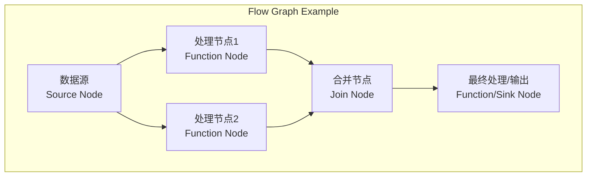

# oneTBB 项目概述

## 1. 项目目标与核心优势

oneAPI Threading Building Blocks (oneTBB) 是一个 C++ 模板库，旨在简化在 C++ 程序中添加并行性的复杂工作，帮助开发者充分利用多核处理器的性能，即使开发者不是线程专家。其核心目标是提高开发效率和程序性能。

**核心优势**:

*   **基于任务而非线程**: 开发者关注逻辑上的并行任务，而非直接管理线程，库负责将任务映射到物理线程。
*   **性能导向**: 专注于通过并行化提升应用程序性能，尤其是数据并行任务。
*   **可组合性 (Composability)**: 使用 oneTBB 的并行组件可以轻松地嵌套和组合，而不会导致过度订阅（线程过多）的问题。
*   **可扩展性 (Scalability)**: 程序性能通常能随处理器核心数的增加而提升。
*   **兼容性**: 可以与其他线程库（如 Pthreads, Windows Threads）以及 OpenMP 等并行编程模型共存。
*   **抽象与易用**: 提供高层次的并行模式（如并行循环、规约）和并发数据结构，隐藏底层复杂性。

参考来源: [oneTBB GitHub README](https://github.com/uxlfoundation/oneTBB)

## 2. 主要模块概览

oneTBB 主要由以下几个核心模块构成：

*   **并行算法 (Parallel Algorithms)**: 提供常见的并行模式，如 `parallel_for`, `parallel_reduce`, `parallel_scan`, `parallel_sort` 等。
*   **任务调度 (Task Scheduling)**: 库的核心引擎，基于工作窃取（work-stealing）算法管理和调度任务。`task_arena`, `task_group` 是其关键用户接口。
*   **并发容器 (Concurrent Containers)**: 提供线程安全的容器，如 `concurrent_vector`, `concurrent_hash_map`, `concurrent_queue` 等。
*   **流图 (Flow Graph)**: 提供一种基于图的、高度可配置的并行编程模型，适用于复杂的依赖关系和流水线处理。
*   **内存管理 (Memory Management)**: 提供高性能、可扩展的内存分配器 (`scalable_allocator`, `cache_aligned_allocator`) 和内存池 (`memory_pool`)，缓解并行程序中的内存分配瓶颈。
*   **同步原语 (Synchronization Primitives)**: 提供各种锁（`mutex`, `spin_mutex`, `rw_mutex`, `spin_rw_mutex`）和原子操作支持，用于线程间同步。

## 3. 模块关系图

下图展示了 oneTBB 主要模块之间的高层依赖关系：

```mermaid
graph TD
    subgraph "用户应用 (User Application)"
        A[并行算法<br>parallel_for, parallel_reduce, ...]
        B[流图<br>Flow Graph]
        C[并发容器<br>concurrent_vector, concurrent_hash_map, ...]
    end

    subgraph "核心引擎 (Core Engine)"
        D[任务调度<br>Task Scheduling<br>(Work Stealing)]
        E[内存管理<br>Memory Management<br>(scalable_allocator)]
        F[同步原语<br>Synchronization Primitives<br>(mutex, atomics)]
    end

    A --> D;
    B --> D;
    A --> E;
    B --> E;
    C --> E;
    A --> F;
    B --> F;
    C --> F;
    D --> F;
    D --> E;

    style A fill:#f9f,stroke:#333,stroke-width:2px
    style B fill:#f9f,stroke:#333,stroke-width:2px
    style C fill:#f9f,stroke:#333,stroke-width:2px
    style D fill:#ccf,stroke:#333,stroke-width:2px
    style E fill:#ccf,stroke:#333,stroke-width:2px
    style F fill:#ccf,stroke:#333,stroke-width:2px
```

**说明**:

*   用户应用层直接使用并行算法、流图和并发容器来实现并行逻辑。
*   这些高层组件依赖于底层的任务调度、内存管理和同步原语。
*   任务调度器是核心，它本身也需要内存管理（分配任务对象）和同步原语（保护内部数据结构）。

## 4. 关键算法/机制图解

### 4.1 `parallel_for` 工作原理

`parallel_for` 将一个大的迭代范围分割成小块，然后并行处理这些小块。

```mermaid
graph LR
    subgraph "parallel_for(range, body)"
        direction TB
        R[原始范围<br>Range (0..N)] --> S1[分割任务<br>Split Task];
        S1 -->|Partition| SB1[子范围1<br>SubRange1];
        S1 -->|Partition| SB2[子范围2<br>SubRange2];
        S1 -->|...| SBN[子范围N<br>SubRangeN];

        subgraph "并行执行 (Parallel Execution)"
            direction LR
            P1[线程1<br>Execute(body, SB1)];
            P2[线程2<br>Execute(body, SB2)];
            PN[线程N<br>Execute(body, SBN)];
        end
        SB1 --> P1;
        SB2 --> P2;
        SBN --> PN;
    end
    style R fill:#lightgrey
    style S1 fill:#lightblue
    style SB1 fill:#lightyellow
    style SB2 fill:#lightyellow
    style SBN fill:#lightyellow
    style P1 fill:#lightgreen
    style P2 fill:#lightgreen
    style PN fill:#lightgreen
```

### 4.2 `parallel_reduce` 工作原理

`parallel_reduce` 不仅并行处理子范围，还需要将子范围的结果合并（归约）。

```mermaid
graph TD
    subgraph "parallel_reduce(range, identity, body, join)"
        R[原始范围<br>Range] --> S[分割任务<br>Split Task];
        S -->|Partition| SB1[子范围1<br>SubRange1];
        S -->|Partition| SB2[子范围2<br>SubRange2];
        S -->|...| SBN[子范围N<br>SubRangeN];

        subgraph "并行计算 Body (Parallel Execution)"
            direction LR
            C1[线程1: body(SB1) -> Res1];
            C2[线程2: body(SB2) -> Res2];
            CN[线程N: body(SBN) -> ResN];
        end
        SB1 --> C1;
        SB2 --> C2;
        SBN --> CN;

        subgraph "归约 Join (Parallel Reduction)"
            direction TB
            J1[Join(Res1, Res2) -> Res1_2];
            J2[Join(Res3, Res4) -> Res3_4];
            JN[...]
            J_Final[最终归约 -> Final Result];
        end
        Res1 --> J1;
        Res2 --> J1;
        C1 -.-> Res1;
        C2 -.-> Res2;
        CN -.-> ResN;
        ResN --> JN;
        J1 --> J_Final;
        J2 --> J_Final;
        JN --> J_Final;

        C1 -- Implicit dependency --> J1;
        C2 -- Implicit dependency --> J1;
    end
    style R fill:#lightgrey
    style S fill:#lightblue
    style SB1 fill:#lightyellow
    style SB2 fill:#lightyellow
    style SBN fill:#lightyellow
    style C1 fill:#lightgreen
    style C2 fill:#lightgreen
    style CN fill:#lightgreen
    style J1 fill:#orange
    style J2 fill:#orange
    style JN fill:#orange
    style J_Final fill:#red
```

### 4.3 任务调度 (Work-Stealing)

TBB 调度器使用工作窃取来保持线程忙碌。

```mermaid
graph TD
    subgraph "TBB Scheduler"
        direction LR
        T1[线程1<br>Worker Thread 1]
        T2[线程2<br>Worker Thread 2]
        T3[线程3<br>Worker Thread 3]

        Q1[任务队列1<br>[T1a, T1b, T1c]]
        Q2[任务队列2<br>[T2a]]
        Q3[任务队列3<br>[]]

        T1 --> Q1;
        T2 --> Q2;
        T3 --> Q3;

        subgraph "工作窃取 (Work Stealing)"
            Q1 -- Steal Attempt --> T3;
            Q2 -- Steal Attempt --> T3;
            T3 -- Steals Task T1c --> Q1;
        end

        subgraph "执行 (Execution)"
            T1 -- Executes --> T1a;
            T2 -- Executes --> T2a;
            T3 -- Executes --> T1c;
        end

    end

    style Q1 fill:#lightblue
    style Q2 fill:#lightblue
    style Q3 fill:#lightgrey
    style T1 fill:#lightgreen
    style T2 fill:#lightgreen
    style T3 fill:#lightgreen
```

### 4.4 流图 (Flow Graph) 概念

流图通过节点和边来表示数据流和计算依赖。



## 5. 总结

oneTBB 是一个强大且成熟的 C++ 并行库，通过提供高层次抽象、高效的调度机制和丰富的并发工具，极大地简化了并行程序的开发，帮助开发者释放多核处理器的潜力。其模块化的设计使得开发者可以根据需要选择合适的组件。理解其核心模块（特别是任务调度、并行算法和并发容器）以及关键设计思想（如工作窃取）对于有效使用该库至关重要。 