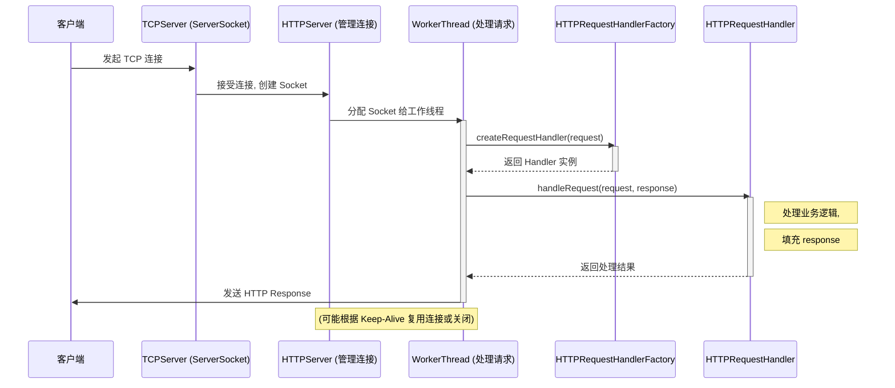

# POCO Net 模块详解

`Net` 模块是 POCO 中提供网络编程能力的核心组件，它构建于 `Foundation` 模块之上，提供了广泛的网络协议支持和网络相关工具。

## 主要功能

1.  **套接字 (Sockets):** 提供了跨平台的套接字 API 抽象，支持 TCP (`StreamSocket`, `ServerSocket`), UDP (`DatagramSocket`), 多播 (`MulticastSocket`), ICMP (`ICMPSocket`) 和原始套接字 (`RawSocket`)。
2.  **网络地址与主机名解析:** `SocketAddress`, `IPAddress` 类用于处理网络地址，`DNS` 类用于主机名解析和反向解析。
3.  **HTTP:** 提供了完整的 HTTP/1.1 客户端 (`HTTPClientSession`, `HTTPRequest`, `HTTPResponse`) 和服务器 (`HTTPServer`, `HTTPServerRequest`, `HTTPServerResponse`, `HTTPRequestHandler`, `HTTPRequestHandlerFactory`) 实现。支持 Keep-Alive, Chunked Transfer Encoding, SSL/TLS (通过 `NetSSL_OpenSSL` 模块), WebSocket 等。
4.  **FTP:** 提供了 FTP 客户端 (`FTPClientSession`) 功能。
5.  **邮件协议:** 包含 SMTP (`SMTPClientSession`) 用于发送邮件和 POP3 (`POP3ClientSession`) 用于接收邮件的客户端实现。
6.  **NTP:** `NTPClient` 类用于通过网络时间协议同步时间。
7.  **Reactor 模式:** `SocketReactor` 和 `SocketNotifier` 提供了基于 Reactor 设计模式的事件驱动网络编程框架。
8.  **流封装:** 将网络连接封装为 C++ 流 (`SocketStream`, `HTTPSessionStream`)，方便进行读写操作。
9.  **URI 支持:** 继承自 Foundation 的 `URI` 类在此模块中广泛用于表示网络资源。

## 设计特点

*   **分层设计:** 底层是跨平台的套接字抽象，上层构建了各种应用层协议（HTTP, FTP, SMTP 等）。
*   **面向对象:** 网络概念（如会话、请求、响应）被良好地封装在类中。
*   **可扩展性:** HTTP 服务器使用 `HTTPRequestHandlerFactory` 和 `HTTPRequestHandler` 接口，允许用户轻松定制请求处理逻辑。
*   **与 Foundation 集成:** 大量使用 Foundation 模块的功能，如流、线程、异常处理、日期时间等。

## 关键组件关系示例 (HTTP 服务器)

以下 Mermaid 图展示了 POCO HTTP 服务器处理请求的基本流程：

*   `ServerSocket` (或其内部使用的 `TCPServer`) 监听指定端口，接受客户端的 TCP 连接。
*   `HTTPServer` 负责管理服务器的生命周期和接受的连接。
*   当新连接到达时，`HTTPServer` 通常会将其交给一个内部的工作线程（`HTTPWorker`）。
*   工作线程从连接中读取 HTTP 请求数据。
*   工作线程通过 `HTTPRequestHandlerFactory` 创建一个合适的 `HTTPRequestHandler` 来处理该请求。
*   `handleRequest` 方法被调用，执行具体的业务逻辑，并填充 `HTTPServerResponse`。
*   工作线程将 `HTTPServerResponse` 发送回客户端。

Net 模块提供了构建各种网络应用程序所需的大部分基础功能。 