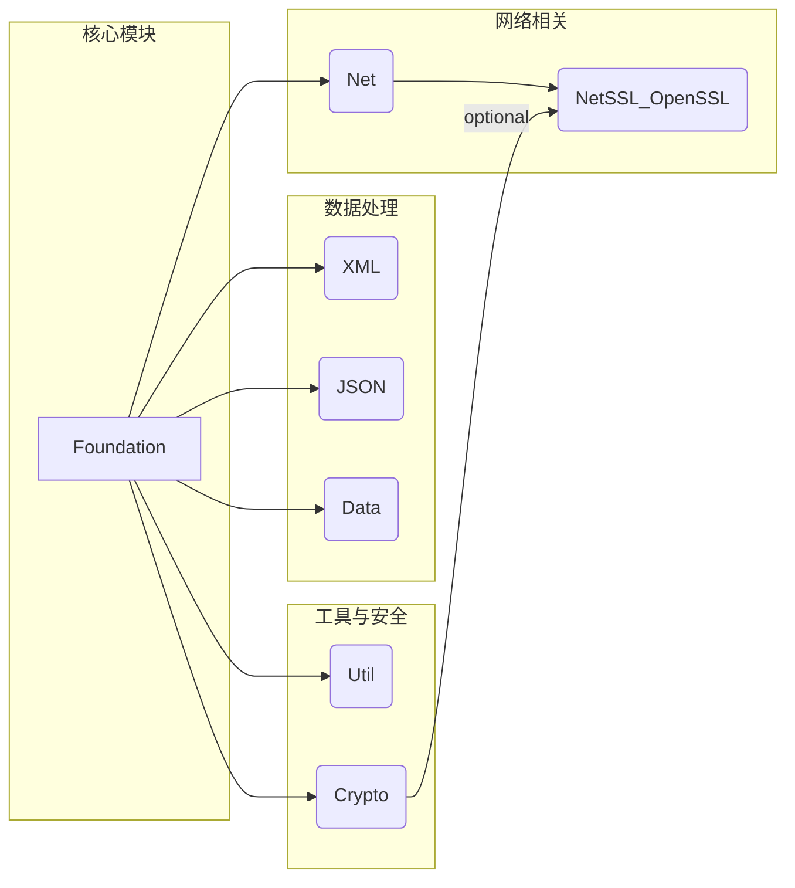

# POCO C++ Libraries 项目概述

POCO (POrtable COmponents) C++ Libraries 是一组开源的 C++ 类库，旨在简化和加速网络中心、可移植的 C++ 应用程序的开发。它的设计目标是提供一套功能强大、易于使用、高效且跨平台的 C++ 组件。

## 设计理念

*   **现代 C++:** 广泛使用 C++ 标准库特性（如 STL）、异常处理、RAII (资源获取即初始化) 等。
*   **可移植性:** 设计时充分考虑跨平台性，支持多种操作系统（Windows, Linux, macOS, \*BSD 等）和编译器。
*   **一致性:** 提供统一的编程模型和 API 风格。
*   **模块化:** 库被划分为多个逻辑模块，开发者可以根据需要选择性地使用。
*   **网络中心:** 特别关注网络编程，提供了丰富的网络协议和功能支持。

## 核心模块

POCO 包含多个模块，主要模块包括：

*   **Foundation:** 基础库，提供平台抽象、基本数据类型、流、日志、配置、线程、内存管理、通知框架等核心功能。几乎所有其他模块都依赖于 Foundation。
*   **Net:** 网络库，包含套接字、HTTP、FTP、SMTP、POP3、NTP 等网络协议的实现，以及 URI 处理等功能。
*   **XML:** 提供 XML 文档的解析（DOM 和 SAX）和 XPath 支持。
*   **JSON:** 提供 JSON 数据的解析和序列化功能。
*   **Util:** 提供一些实用的工具类，如命令行选项解析、缓存框架、应用程序框架、定时器等。
*   **Data:** 数据库访问抽象层，支持 ODBC、MySQL、SQLite、PostgreSQL 等多种数据库后端。
*   **Crypto:** 提供加密功能，如摘要算法、加密算法、随机数生成、数字签名等（通常依赖 OpenSSL）。
*   **NetSSL\_OpenSSL:** 为 Net 模块提供基于 OpenSSL 的 SSL/TLS 支持。

## 模块依赖关系 (简化)

下面是一个简化的模块依赖关系图：

这个概述文件提供了对 POCO 项目的初步了解。接下来，我将为核心的 `Foundation` 模块创建更详细的说明。 