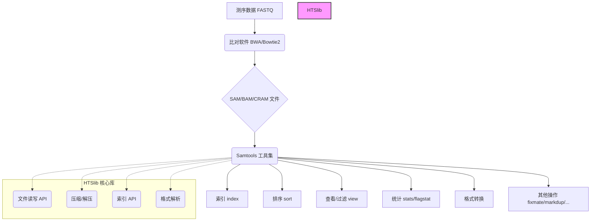

# Samtools 项目概述

## 1. 项目目标与定位

Samtools 是一套用于处理高通量测序数据的工具集，特别专注于 SAM (Sequence Alignment/Map), BAM (Binary Alignment/Map) 和 CRAM 格式的文件。这些格式是存储测序读段（reads）比对到参考基因组结果的标准。

Samtools 的核心目标是提供高效、可靠的方法来读取、写入、编辑、索引和分析比对数据。它是生物信息学分析流程中不可或缺的基础工具之一，广泛应用于基因组学、转录组学等领域。

## 2. 核心数据格式

*   **SAM (Sequence Alignment/Map):** 基于文本的格式，可读性强，但文件体积较大。每一行代表一个比对记录或头部信息。
*   **BAM (Binary Alignment/Map):** SAM 格式的二进制压缩版本，体积更小，适合存储和传输。需要通过 `samtools view` 等命令来查看内容。BAM 文件通常需要索引 (`.bai` 文件) 才能实现快速的区域性访问。
*   **CRAM:** 比 BAM 压缩率更高的格式，它通过参考序列来压缩存储比对信息。读取 CRAM 文件通常需要提供对应的参考基因组序列 (FASTA 格式)。CRAM 文件也需要索引 (`.crai` 文件)。

## 3. 与 HTSlib 的关系

Samtools 的核心功能，特别是对 SAM/BAM/CRAM 文件的底层读写和操作，是建立在 **HTSlib** 这个 C 库之上的。HTSlib 提供了一套统一的 API 来处理这些高通量测序数据格式。

可以认为 Samtools 是 HTSlib 的一个主要用户接口，它将 HTSlib 提供的底层功能封装成一系列方便易用的命令行工具。BCFtools (用于处理 VCF/BCF 格式) 也是基于 HTSlib 构建的。

## 4. 整体架构示意图

这个概述文件为理解 `samtools` 的基本背景和定位提供了基础。后续文件将深入探讨具体的模块和命令。 