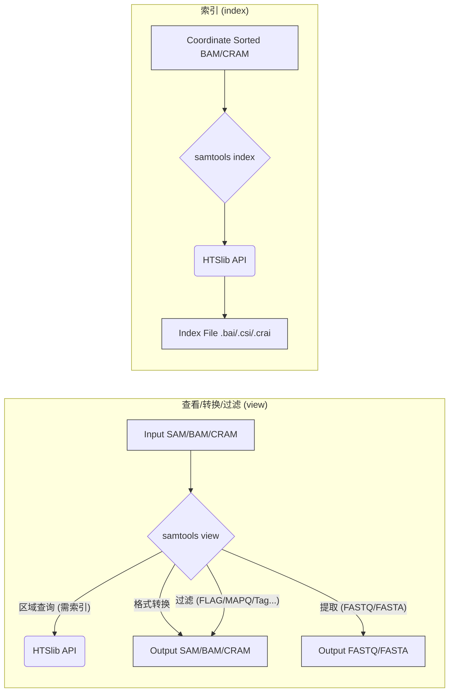

# Samtools 核心 IO 与索引

## 1. samtools view: 查看、转换与过滤

`samtools view` 是 Samtools 中最基础和最常用的命令之一，承担着多种核心任务：

*   **格式转换:**
    *   SAM -> BAM: `samtools view -bS in.sam > out.bam`
    *   BAM -> SAM: `samtools view -h in.bam > out.sam` ( `-h` 包含头信息)
    *   BAM -> CRAM: `samtools view -C -T ref.fa in.bam > out.cram` (需要参考基因组 `-T`)
    *   CRAM -> BAM: `samtools view -b -T ref.fa in.cram > out.bam`
*   **查看内容:** 直接输出 BAM/CRAM 内容到终端（通常是 SAM 格式）。
*   **过滤比对:**
    *   根据 FLAG 过滤: `-f` (包含指定 flag), `-F` (排除指定 flag)。例如, `-f 2` 只保留比对上的 paired reads, `-F 4` 排除未比对上的 reads。
    *   根据区域过滤: `samtools view in.bam chr1:1000-2000` 查看指定区域的比对。这需要 BAM/CRAM 文件已排序并建立了索引。
    *   根据比对质量过滤: `-q` 过滤 MAPQ 低于阈值的比对。
    *   根据 Read Group (RG) 过滤: `-r`
    *   根据标签 (Tag) 过滤: `-d tag:value`
    *   使用过滤表达式: `-e '表达式'` (例如 `-e '[NH] == 1'` 选择唯一比对)
*   **提取/排除信息:**
    *   提取 FASTQ/FASTA: `-O fastq` 或 `-O fasta`
    *   排除指定 Tag: `-x TAG`

`samtools view` 的底层实现依赖 HTSlib 提供的 `sam_read1`, `sam_write1` 等函数来高效地处理记录。

## 2. samtools index: 创建索引

索引文件是实现对大型 BAM 或 CRAM 文件进行快速随机访问的关键。没有索引，要提取特定区域的比对信息就需要从头读取整个文件，效率极低。

*   **命令:** `samtools index sorted.bam` 或 `samtools index sorted.cram`
*   **输入要求:** 输入的 BAM/CRAM 文件必须是**按坐标排序 (coordinate sorted)** 的。通常使用 `samtools sort` 命令完成排序。
*   **输出文件:**
    *   BAM 索引: 默认生成 `.bai` (BAM Index) 文件。对于较大的基因组或文件，也可以生成 `.csi` (Coordinate-Sorted Index) 格式索引 (`-c`)，它支持更大的坐标范围和更灵活的分箱策略。
    *   CRAM 索引: 生成 `.crai` 文件。
*   **索引原理 (BAI):** BAI 索引（主要针对 BAM）采用分层分箱 (binning) 的策略。它将基因组划分为不同大小的区域（bins），并记录每个 bin 内的比对记录在压缩的 BAM 文件中的起始和结束位置（虚拟文件偏移量）。同时，它还维护一个线性索引，用于快速定位到粗略的位置。当查询特定区域时，Samtools 可以利用索引快速确定哪些文件块 (chunks) 可能包含该区域的比对，从而只需解压和读取相关的数据块，大大提高了查询效率。

## 3. 工作流程示意图

